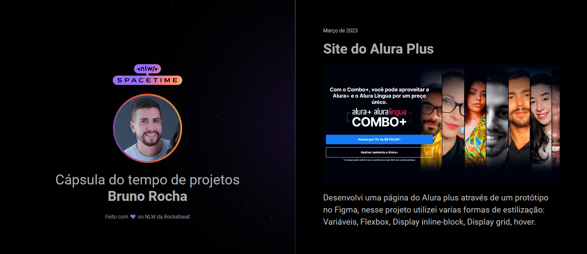

<h1 align="center"> Cápsula do Tempo </h1>

Projeto densenvolvido durante a NLW Scapacetime da Rocketseat.

  <a href="#-tecnologias">Tecnologias</a>&nbsp;&nbsp;&nbsp;|&nbsp;&nbsp;&nbsp;
  <a href="#-projeto">Projeto</a>&nbsp;&nbsp;&nbsp;|&nbsp;&nbsp;&nbsp;
  <a href="#-layout">Layout</a>&nbsp;&nbsp;&nbsp;|&nbsp;&nbsp;&nbsp;
  <a href="#memo-licença">Licença</a>

  

 

  

## 🚀 Tecnologias

Esse projeto foi desenvolvido com as seguintes tecnologias:

- HTML  
- CSS
- Figma
- Git e Github

## 💻 Projeto

Esse é um projeto Web Reponsivo de uma cápsula do tempo para exibir alguns projetos em uma linha do tempo.

## 🔖 Layout

Você pode estar visualizando o layout do projeto através.
[Desse link](https://www.figma.com/file/jcwhomSmukUihXu0FE8Bto/C%C3%A1psula-do-tempo-%E2%80%A2-Trilha-Explorer-(Community)-(Copy)?type=design&node-id=0%3A1&t=6YHWQDlO9ja74Jny-1). 
É necessário ter uma conta no [Figma](https://www.figma.com/file/jcwhomSmukUihXu0FE8Bto/C%C3%A1psula-do-tempo-%E2%80%A2-Trilha-Explorer-(Community)-(Copy)?type=design&node-id=0%3A1&t=6YHWQDlO9ja74Jny-1).

## :memo: Licença

Esse projeto está sob a licença MIT.
